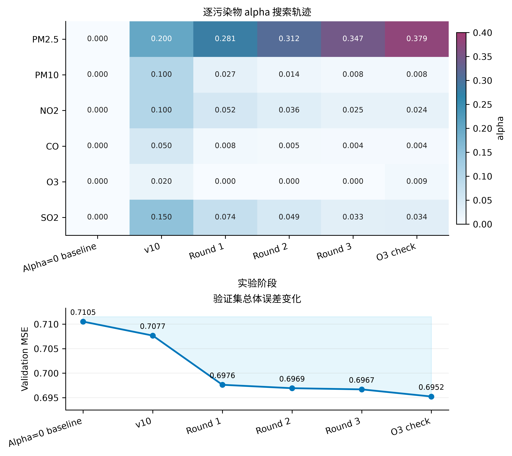
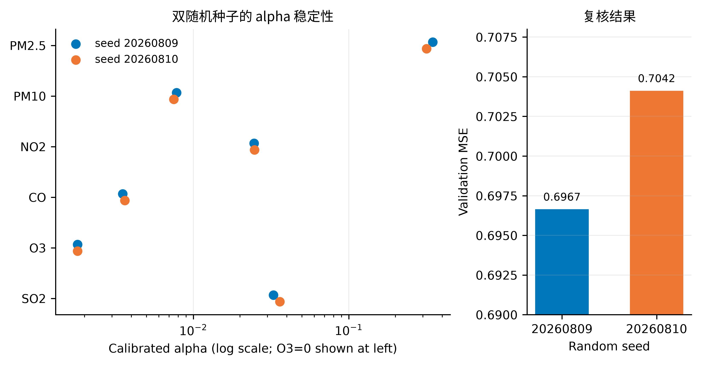
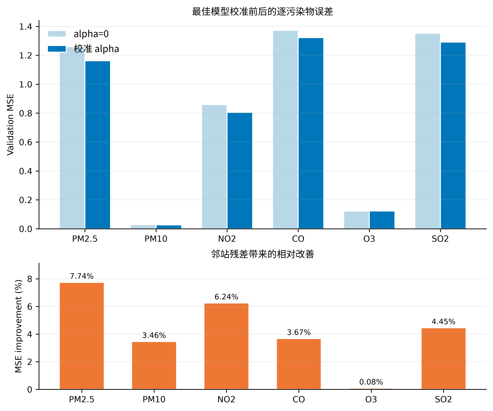
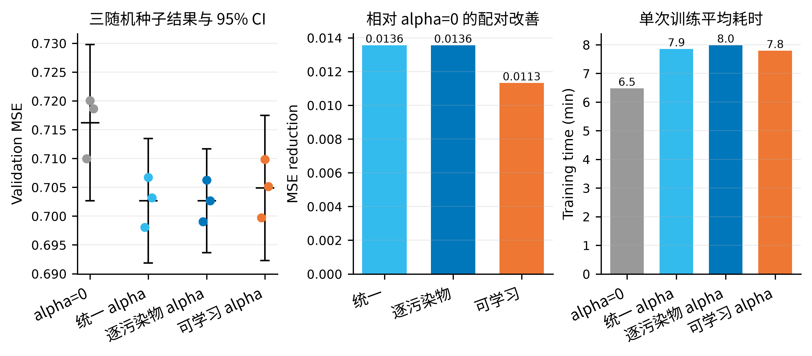
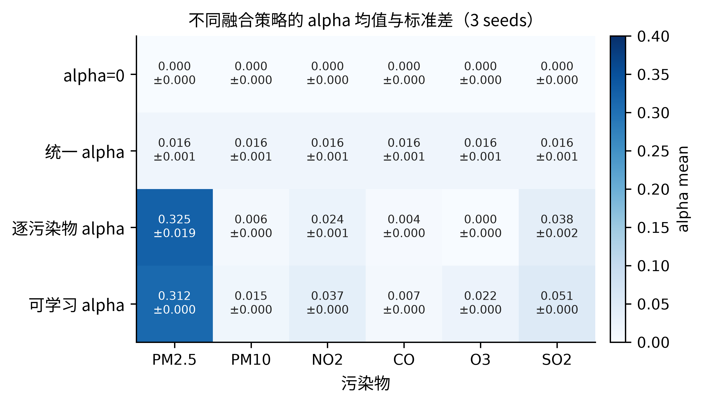
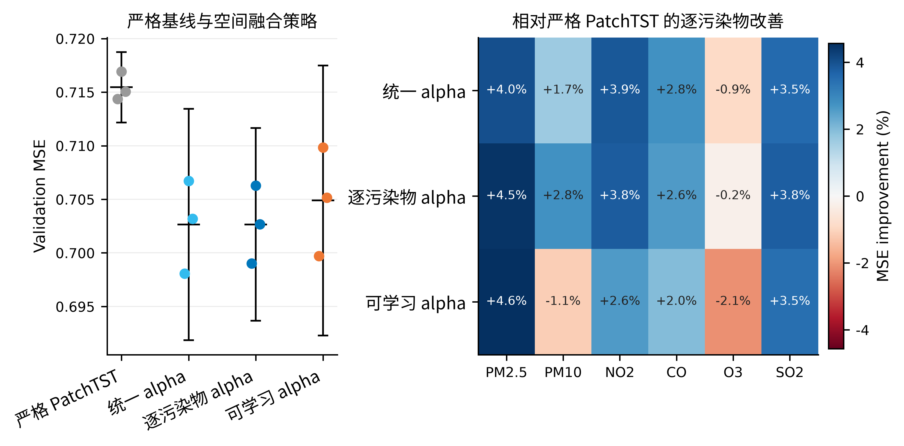

# ST-PatchTST 逐污染物 alpha 搜索实验记录

> 暂定论文题目：《基于时空特征融合与 PatchTST 的多站点空气质量预测研究》
> 学科方向：新一代电子信息技术
> 实验日期：2026-08-09
> 文档定位：独立实验记录，可作为后续论文“超参数分析/消融实验”的素材；不是论文正文。

## 1. 实验结论摘要

本次实验回答的是：ST-PatchTST 中六种污染物对应的空间残差融合系数 alpha 应如何设置，以及当前参数能否称为“最优”。主要结论如下。

1. **不能把某一组 alpha 称为全局最优值。** 在固定模型权重的条件下，可以精确求出该模型在验证集上的条件最优 alpha；但重新训练会改变邻站分支输出尺度，因此不同随机种子和不同训练轮次的最优数值会发生变化。
2. **当前搜索到的最低验证集 MSE 为 0.695230。** 它来自 O3 补充消融模型，对应校准 alpha 为 `0.3789 / 0.0078 / 0.0237 / 0.0037 / 0.0087 / 0.0342`。这是“本次已探索配置中的最佳验证集结果”，不能外推为理论全局最优。
3. **建议训练初值为** `0.3124 / 0.0139 / 0.0357 / 0.0054 / 0.0200 / 0.0490`，并在训练结束、恢复最低验证损失权重后，再针对该次模型做一次验证集闭式校准。
4. PM2.5 从邻站信息中获益最大；NO2、SO2、CO 和 PM10 有程度不同的收益；O3 的收益很小，但训练时不宜把其 alpha 设为 0，否则对应邻站输出通道无法获得梯度。补强消融进一步表明，这种系数异质性具有解释价值，但在当前 30-epoch 协议下没有转化为优于统一 alpha 的总体 MSE。
5. 已查看测试集的主搜索第三轮模型 test MSE 为 0.573428。O3 补充实验发生在这次测试之后，因此暂不报告其测试性能；论文最终结论应在新的留出集、外部城市或重新冻结的测试集上复核。
6. 新增严格中心站 PatchTST 三随机种子基线后，其 valid MSE 为 `0.715453 ± 0.001327`；统一和逐污染物空间融合相对该严格基线均改善约 **1.79%**。这属于稳定但幅度有限的增益，若空间模块是论文核心创新，仍建议继续改进。

## 2. 问题背景与模型中的 alpha

数据由北京 17 个监测站构成，中心站编号为 1013。输入使用过去 168 小时，预测未来 24 小时；每个站点包含 12 个变量，其中前六个为 PM2.5、PM10、NO2、CO、O3 和 SO2。预处理后的数组形状为：

| 数据项 | 形状或规模 |
|---|---:|
| 输入 `X` | `(8569, 204, 168)` |
| 标签 `y` | `(8569, 12, 24)` |
| 站点数 | 17 |
| 验证样本数 | 852 |
| 测试样本数 | 1705 |

ST-PatchTST 由中心站 PatchTST 分支和邻站时空特征分支组成。对污染物 \(j\)，最终输出可写为：

$$
\hat{y}_j = \hat{y}^{\mathrm{center}}_j + \alpha_j\,\Delta\hat{y}^{\mathrm{neighbor}}_j,
$$

其中 \(\hat{y}^{\mathrm{center}}_j\) 是中心站预测，\(\Delta\hat{y}^{\mathrm{neighbor}}_j\) 是由空间差分、交叉注意力和时间卷积得到的邻站残差，\(\alpha_j\) 决定邻站信息的融合强度。气象变量不参与该融合，其 alpha 固定为 0。

将六个污染物 alpha 全部设为 0 时，最终输出退化为中心站 PatchTST 分支，可作为 PatchTST 基线。为了保证公平，基线和改进模型应使用相同的数据划分、历史窗口、预测长度、训练轮数和评估指标。多站点数组可以继续作为统一的数据入口，但 alpha 为 0 后邻站分支不会影响最终预测；若要复现原始单站点 PatchTST，还应使用 `data_preparation_single.py` 单独报告一组结果，避免把“同框架退化基线”和“原始实现复现”混为一谈。

## 3. 搜索方法

### 3.1 为什么没有采用普通网格搜索

六个 alpha 若各取 9 个候选值，完整组合已有 \(9^6=531441\) 组；每组都重新训练会造成不可接受的计算开销。更重要的是，在模型权重固定后，输出关于 alpha 是仿射函数，因此可以直接求每个污染物的验证集 MSE 最小点。

令 \(b=\hat{y}(\alpha=0)\)、\(d=\hat{y}(\alpha=1)-b\)、真实值为 \(y\)，则目标为：

$$
\min_{\alpha}\left\|y-(b+\alpha d)\right\|_2^2.
$$

其闭式解为：

$$
\alpha^*=\frac{d^\top(y-b)}{d^\top d},
$$

实验中再将结果截断到预设区间 \([0,0.4]\)。该方法等价于在连续区间中寻找固定模型的验证集最优点，精度高于有限网格，也不需要额外训练数百个模型。

### 3.2 迭代策略

搜索遵循“训练—校准—将校准值作为下一轮训练初值”的过程：

1. 固定数据划分、网络结构和学习率，使用一组 alpha 训练 50 个 epoch；
2. 恢复最低验证损失对应的模型权重；
3. 仅在验证集上计算每种污染物的闭式校准 alpha；
4. 将校准结果作为下一轮训练的 alpha；
5. 验证集收益趋于饱和后，用第二个随机种子复核稳定性；
6. 对训练 alpha 为 0、因而无法正常学习的 O3 通道补做非零初值消融。

主搜索随机种子为 `20260809`，复核种子为 `20260810`，学习率固定为 `1e-4`。搜索过程中不使用测试集选择 alpha。

## 4. 实验过程与结果

### 4.1 初始状态核查

代码中的 v10 配置为 `0.20 / 0.10 / 0.10 / 0.05 / 0.02 / 0.15`，文档记录的 valid MSE 为 0.707657、test MSE 为 0.575464。alpha 全为 0 的退化基线 valid MSE 为 0.710511、test MSE 为 0.577002。

核查已有模型文件时发现，其内部保存的 alpha 为 `0.25 / 0.08 / 0.12 / 0.02 / 0 / 0.18`，与代码和旧文档不一致。因此本次实验不把该模型内的数值直接当作最终配置，只利用其输出做了一次条件最优估计，得到约 `0.2653 / 0.0443 / 0.0760 / 0.0130 / 0 / 0.1144`，并以此启动正式迭代。

### 4.2 三轮主搜索

| 阶段 | 训练 alpha（PM2.5 / PM10 / NO2 / CO / O3 / SO2） | 验证集校准 alpha | valid MSE |
|---|---|---|---:|
| alpha=0 基线 | 0 / 0 / 0 / 0 / 0 / 0 | 不适用 | 0.710511 |
| v10 记录 | 0.2000 / 0.1000 / 0.1000 / 0.0500 / 0.0200 / 0.1500 | 未记录 | 0.707657 |
| Round 1 | 0.2653 / 0.0443 / 0.0760 / 0.0130 / 0 / 0.1144 | 0.2811 / 0.0266 / 0.0523 / 0.0084 / 0 / 0.0745 | 0.697620 |
| Round 2 | 0.2811 / 0.0266 / 0.0523 / 0.0084 / 0 / 0.0745 | 0.3124 / 0.0139 / 0.0357 / 0.0054 / 0 / 0.0490 | 0.696926 |
| Round 3 | 0.3124 / 0.0139 / 0.0357 / 0.0054 / 0 / 0.0490 | 0.3467 / 0.0078 / 0.0246 / 0.0035 / 0 / 0.0328 | 0.696684 |



**图 1 逐污染物 alpha 搜索轨迹与验证集总体 MSE 变化。** Round 1 带来最明显的性能提升；Round 2 和 Round 3 仍有改善，但边际收益已经缩小。O3 check 为后续补充消融，不属于原三轮主搜索。

从 alpha=0 基线到 Round 3，valid MSE 从 0.710511 降至 0.696684，相对下降约 1.95%。Round 1 已取得大部分收益，后两轮的改善分别仅为 0.000694 和 0.000242，说明迭代开始收敛。与此同时，PM2.5 的校准 alpha 逐轮增大，而 PM10、NO2、CO 和 SO2 逐轮减小，表明不同污染物的有效融合尺度存在明显差异。该差异支持逐污染物解释，但补强实验显示它尚不足以证明逐污染物策略的总体预测精度优于统一 alpha。

### 4.3 双随机种子复核

第二个随机种子使用 Round 3 的训练 alpha，得到如下结果：

| 随机种子 | PM2.5 | PM10 | NO2 | CO | O3 | SO2 | valid MSE |
|---:|---:|---:|---:|---:|---:|---:|---:|
| 20260809 | 0.3467 | 0.0078 | 0.0246 | 0.0035 | 0 | 0.0328 | 0.696684 |
| 20260810 | 0.3165 | 0.0075 | 0.0247 | 0.0036 | 0 | 0.0361 | 0.704152 |



**图 2 双随机种子的校准 alpha 与验证集误差。** PM10、NO2、CO 和 SO2 的校准值较接近；PM2.5 的绝对差异约为 0.0301，显示出更明显的训练随机性。两个模型的 valid MSE 也不同，因此仅凭单随机种子不宜给出过强结论。

将两个模型联合考虑时，一组折中校准值为 `0.3320 / 0.0076 / 0.0247 / 0.0036 / 0 / 0.0343`；其在两个种子上的 valid MSE 分别为 0.696708 和 0.704178，与各自单独校准值相比损失很小。这说明除 PM2.5 外，其余通道已表现出一定稳定性，但正式论文仍建议扩展到至少 3—5 个随机种子并报告均值和标准差。

### 4.4 O3 补充消融

前三轮训练中 O3 的 alpha 为 0。由于最终输出中邻站残差前的乘数为 0，O3 邻站输出通道收到的梯度也为 0。因此，“校准结果仍为 0”并不能证明 O3 不需要空间信息，它也可能只是从未学会有效的邻站表示。

为排除该问题，在保持其他设置不变的条件下，将 O3 训练 alpha 改为 0.02，使用种子 `20260809` 重新训练 50 个 epoch。校准结果为：

| 污染物 | alpha=0 时 valid MSE | 校准后 valid MSE | 相对改善 | 校准 alpha |
|---|---:|---:|---:|---:|
| PM2.5 | 1.259457 | 1.161974 | 7.74% | 0.3789 |
| PM10 | 0.027360 | 0.026414 | 3.46% | 0.0078 |
| NO2 | 0.858869 | 0.805265 | 6.24% | 0.0237 |
| CO | 1.372379 | 1.321978 | 3.67% | 0.0037 |
| O3 | 0.122274 | 0.122172 | 0.08% | 0.0087 |
| SO2 | 1.351654 | 1.291551 | 4.45% | 0.0342 |



**图 3 O3 补充模型在验证集上关闭邻站残差（alpha=0）与逐污染物闭式校准后的误差对比。** PM2.5 和 NO2 的相对改善最明显；O3 的改善仅为 0.08%，说明非零初始化解决了训练路径问题，但当前数据下 O3 邻站分支的实际贡献仍较弱。

补充模型校准后的总体 valid MSE 为 **0.695230**，相对 alpha=0 基线下降约 **2.15%**，是本次搜索中最低的验证集结果。该提升不能简单归因于 O3 本身：重新训练会同时改变所有通道的权重和邻站残差尺度，图 3 展示的是该次模型整体校准前后的通道级变化。

## 5. “最优 alpha”应如何表述

模型中真正起作用的是乘积 \(\alpha_j\Delta\hat{y}^{\mathrm{neighbor}}_j\)。如果邻站分支输出整体放大而 alpha 相应缩小，最终预测可能保持不变。因此 alpha 与邻站输出之间存在**尺度不可辨识性**。由此产生三个层次的“最优”：

- **固定权重下的条件最优**：闭式解可精确得到，是本次校准所保证的含义；
- **当前搜索范围内的经验最优**：O3 补充模型的 valid MSE 0.695230 属于这一层次；
- **跨随机种子、跨数据集的全局最优**：现有实验不能证明，也不建议在论文中这样表述。

论文中可使用如下措辞：

> 在固定模型权重及验证集的条件下，采用最小二乘闭式解对各污染物空间残差融合系数进行校准。实验获得的最低验证集 MSE 为 0.695230，较 alpha=0 的退化基线降低 2.15%。该结果表示当前搜索范围内的经验最优，而非跨训练实例的全局最优。

## 6. 推荐配置与使用方式

用于延续原 50-epoch 搜索流程时，当前建议的**训练阶段初值**为：

```python
alpha = [0.3124, 0.0139, 0.0357, 0.0054, 0.0200, 0.0490]
```

推荐流程是：用上述非零初值训练模型，恢复最低 valid-loss 权重，然后调用 `calibrate_pollutant_alpha`，用验证集计算该模型自己的条件最优 alpha。不要把 O3 补充模型的 `0.3789 / 0.0078 / 0.0237 / 0.0037 / 0.0087 / 0.0342` 直接硬编码为所有后续训练的固定参数，因为它是某一次训练权重下的校准结果。

若优先考虑方法简洁和部署稳定性，补强实验支持另一种选择：六通道均以 `0.02` 训练，再在验证集上校准一个共享 alpha；三个种子的共享校准值为 `0.01523`、`0.01538` 和 `0.01632`。该方案与逐污染物校准的平均 MSE 几乎相同，自由度却从 6 个降为 1 个。

若只需要 PatchTST 对照实验，则将六个污染物 alpha 全设为 0，使邻站残差不进入最终输出；同时保持数据划分和训练协议一致。若论文声称复现“原始 PatchTST”，还应另外运行单站点数据准备与原模型实现作为严格基线。

## 7. 补强实验：三随机种子四策略消融

### 7.1 实验设计

为检验原搜索结论能否跨随机种子成立，新增 `20260809`、`20260810` 和 `20260811` 三个种子，对以下四种策略做配对实验：

| 策略 | 训练设置 | 验证集选择方式 |
|---|---|---|
| alpha=0 | 六通道固定为 0 | 不校准 |
| 统一 alpha | 六通道均以 0.02 训练 | 只求一个共享闭式系数 |
| 逐污染物 alpha | 使用推荐向量训练 | 分别求六个闭式系数 |
| 可学习 alpha | 推荐向量初始化，sigmoid 约束到 `[0,0.4]` | 使用最低 valid-loss 权重学到的值 |

四组均训练 30 epoch，batch size 为 16，学习率为 `1e-4`，在同一 AMD Radeon RX 7600 上顺序运行。由于该协议的 epoch 数与原三轮搜索不同，补强实验只用于四策略之间的受控比较，不把其绝对指标与原 50-epoch 结果合并计算。测试集没有参与本轮训练、排序或统计。

### 7.2 三随机种子总体结果

| 策略 | valid MSE | 95% CI | valid RMSE | valid MAE | 相对 alpha=0 的 MSE 改善 |
|---|---:|---:|---:|---:|---:|
| alpha=0 | 0.716219 ± 0.005453 | [0.702672, 0.729766] | 0.846293 ± 0.003225 | 0.554501 ± 0.001625 | — |
| 统一 alpha | **0.702654 ± 0.004348** | [0.691852, 0.713455] | **0.838242 ± 0.002594** | **0.551784 ± 0.001276** | 1.894% |
| 逐污染物 alpha | 0.702658 ± 0.003624 | [0.693655, 0.711661] | 0.838245 ± 0.002162 | 0.552565 ± 0.000577 | 1.893% |
| 可学习 alpha | 0.704894 ± 0.005073 | [0.692292, 0.717495] | 0.839576 ± 0.003021 | 0.554838 ± 0.000971 | 1.581% |



**图 4 三随机种子的 alpha 策略消融、相对基线的配对改善和训练耗时。** 点表示各随机种子，横线和误差棒表示均值及 95% t 置信区间。三种空间融合策略的 MSE 均低于 alpha=0；统一与逐污染物策略几乎重合。

逐 seed 比较显示，统一 alpha 相对 alpha=0 的 MSE 平均下降 0.013565，逐污染物 alpha 平均下降 0.013561，可学习 alpha 平均下降 0.011325。三种空间融合方式在每个配对 seed 上都优于 alpha=0，说明本实验中稳定的收益来源首先是**是否引入邻站空间残差**，而不是 alpha 参数化方式本身。

统一 alpha 与逐污染物 alpha 的均值只相差 `0.000005`：seed 20260809 上统一策略更好 0.000959，另外两个 seed 上逐污染物策略分别更好 0.000441 和 0.000505。该差异远小于随机种子造成的组内波动，因此当前数据不支持“六个独立 alpha 能提高总体预测精度”的强结论。

按污染物汇总三种子后，相对 alpha=0 的 MSE 变化如下（正值表示改善，负值表示退化）：

| 污染物 | 统一 alpha | 逐污染物 alpha | 可学习 alpha |
|---|---:|---:|---:|
| PM2.5 | 4.15% | 4.63% | **4.71%** |
| PM10 | 1.63% | **2.71%** | -1.15% |
| NO2 | **4.14%** | 4.06% | 2.86% |
| CO | **2.33%** | 2.15% | 1.54% |
| O3 | -0.68% | **0.01%** | -1.84% |
| SO2 | 3.57% | **3.78%** | 3.47% |

空间融合的主要收益集中在 PM2.5、NO2、SO2 和 CO。逐污染物策略虽然没有降低总体 MSE 均值，但能将 O3 的 alpha 校准为 0，并在 PM10、SO2 上取得更高的通道级改善；因此它的价值更接近“按通道抑制负迁移与提供解释”，而不是总体指标上的必然优势。可学习策略在 O3 和 PM10 上出现负收益，也解释了其总体 MSE 略高的原因。

### 7.3 alpha 稳定性与可学习策略



**图 5 四种策略在三个随机种子上的最终 alpha 均值与标准差。** 统一策略得到稳定的共享系数 `0.01564 ± 0.00059`。逐污染物校准中 PM2.5 为 `0.32466 ± 0.01872`，数值明显大于其他通道；O3 在三个 seed 上均校准为 0。可学习策略的跨 seed 方差很小，但其数值几乎停留在初始化附近。

逐污染物策略的三种子均值依次为 `0.32466 / 0.00630 / 0.02405 / 0.00378 / 0 / 0.03820`。这再次说明各污染物对应的有效残差尺度不同，尤其是 PM2.5 对邻站残差的权重更高；不过尺度差异也受到邻站输出幅值影响，不能直接解释成污染物之间的物理因果强度。

可学习 alpha 最终均值为 `0.31245 / 0.01468 / 0.03740 / 0.00666 / 0.02197 / 0.05077`，与初始化非常接近。其 MSE 又比逐污染物校准高 0.002235，Holm 校正后的探索性 `p=0.235`。这表明在当前学习率和 30-epoch 预算下，alpha 的端到端梯度更新幅度不足，尚未体现优于闭式校准的优势。后续若继续研究可学习 alpha，应考虑单独的参数组学习率、正则化或交替优化，而不能仅把固定 buffer 改成普通参数。

### 7.4 统计解释与效率

以相同随机种子进行配对 t 检验，并对五个预设比较使用 Holm 校正后，统一、逐污染物和可学习策略相对 alpha=0 的校正 `p` 分别为 0.028、0.035 和 0.035；统一与逐污染物的校正 `p=0.993`。但由于样本量只有 3，无法可靠检验差值的正态性，效应量和置信区间也容易不稳定，因此这些 p 值只能作为探索性佐证，不能替代更多随机种子或独立数据验证。

平均单次训练耗时分别为 6.48、7.86、7.99 和 7.80 分钟。alpha=0 在前向传播中直接跳过邻站分支，因此比空间融合策略快约 17%—19%；三种空间融合策略之间的耗时接近。可学习策略仅比固定策略增加 6 个可训练参数，参数量开销可忽略。这里的 alpha=0 仍保留邻站分支参数但不执行，属于框架内部受控基线；严格的原始 PatchTST 参数量应另行统计。

### 7.5 补强实验结论

本轮补强实验支持以下更稳健的表述：

1. 多站点空间残差融合在三个随机种子上稳定降低 valid MSE，平均改善约 1.6%—1.9%；
2. 逐污染物校准能揭示明显的通道尺度差异，但其总体 MSE 未优于仅校准一个共享 alpha；
3. 统一 alpha 是当前更简洁的工程选择，逐污染物 alpha 更适合做机理分析和通道级解释；
4. 直接端到端学习 alpha 在当前设置下没有胜过闭式校准，需要专门优化策略；
5. 所有结论仍属于验证集证据，尚不能替代新的独立测试集或跨城市泛化实验。

## 8. 严格原生 PatchTST 基线复核

### 8.1 为什么需要重新跑严格基线

前述 `alpha=0` 基线保留了完整 ST-PatchTST 类，只是在前向传播中关闭邻站残差。虽然其输出与中心 PatchTST 分支逐元素相同，但模型仍包含未执行的邻站参数，且模型构造顺序会影响相同随机种子下的权重初始化。为了判断改进幅度是否被该近似基线扭曲，进一步训练了只接收中心站 1013 的 tsai 原生 PatchTST。

严格基线直接从现有北京多站点数组抽取中心站，输入形状为 `(8569, 12, 168)`，标签、时间划分、标准化、随机种子、30-epoch 预算、batch size 16 和学习率 `1e-4` 均与四策略消融一致。该过程没有运行会覆盖现有资产且当前硬编码广州 9022 的 `data_preparation_single.py`，也没有在训练或模型选择中访问测试集。

### 8.2 严格基线下的真实提升

| 策略 | valid MSE | valid RMSE | valid MAE | 相对严格 PatchTST 的 MSE 改善 |
|---|---:|---:|---:|---:|
| 严格 PatchTST | 0.715453 ± 0.001327 | 0.845844 ± 0.000784 | 0.554728 ± 0.000497 | — |
| ST 框架 alpha=0 | 0.716219 ± 0.005453 | 0.846293 ± 0.003225 | 0.554501 ± 0.001625 | -0.11% |
| 统一 alpha | **0.702654 ± 0.004348** | **0.838242 ± 0.002594** | **0.551784 ± 0.001276** | **1.789%** |
| 逐污染物 alpha | 0.702658 ± 0.003624 | 0.838245 ± 0.002162 | 0.552565 ± 0.000577 | 1.788% |
| 可学习 alpha | 0.704894 ± 0.005073 | 0.839576 ± 0.003021 | 0.554838 ± 0.000971 | 1.476% |



**图 6 严格中心站 PatchTST 与三种空间融合策略的三随机种子 valid MSE，以及逐污染物相对改善。** 统一和逐污染物策略的总体收益几乎相同；PM2.5、NO2、CO 和 SO2 是主要收益来源，O3 仍存在轻微负迁移。

统一 alpha 在三个 seed 上相对严格基线分别改善 2.282%、1.426% 和 1.661%，平均为 1.789%；逐污染物 alpha 分别改善 2.148%、1.487% 和 1.731%，平均为 1.789%；可学习 alpha 平均改善 1.476%。因此，严格基线并未推翻此前结论，但将最可靠的改进幅度校正为约 **1.5%—1.8%**。

ST 框架 alpha=0 相对严格 PatchTST 平均差异为 -0.11%，三个 seed 中有正有负，配对检验 `p=0.795`。两者处于相同误差区间，说明之前使用 alpha=0 作为快速消融基线总体上是合理的，但论文主表仍应优先采用本节严格原生 PatchTST 结果。

探索性配对检验中，逐污染物策略相对严格基线的 Holm 校正 `p=0.045`，统一策略为 0.059，可学习策略为 0.082。由于只有三个随机种子，不能据此作强显著性结论；更可靠的证据是统一和逐污染物策略在每个 seed 上均改善，且提升区间分别为 1.43%—2.28% 和 1.49%—2.15%。

### 8.3 是否值得继续改进

当前结果证明空间融合有效，但平均提升约 1.79%，属于**稳定但有限**的增益。如果时空融合是硕士论文的核心创新点，建议继续改进；如果它只是完整系统中的一个子模块，则该幅度配合逐污染物分析和计算代价结果已经可以构成有效消融证据。

进一步改进不应继续把主要计算预算投入 alpha 微调，因为统一与逐污染物校准已经达到近乎相同的总体 MSE，说明门控系数不是当前主要瓶颈。更值得尝试的方向是：加入距离、风向和风速约束的动态邻站选择；显式建模污染传输时滞；对 O3 和 PM10 加入抑制负迁移的通道门控；以及在广州或新时间段验证空间分支能否跨域泛化。

## 9. 测试集结果与证据边界

主搜索 Round 3 模型在校准后只进行过一次测试集评估：

| 指标/污染物 | 数值 |
|---|---:|
| 总体 MSE | 0.573428 |
| RMSE | 0.757250 |
| MAE | 0.504194 |
| PM2.5 MSE | 0.738936 |
| PM10 MSE | 0.095893 |
| NO2 MSE | 0.561341 |
| CO MSE | 0.437184 |
| O3 MSE | 0.260243 |
| SO2 MSE | 0.686092 |

相较旧记录中的 alpha=0 基线 test MSE 0.577002，该结果下降约 0.62%；相较 v10 的 0.575464 下降约 0.35%。但 O3 补充消融是在查看上述测试结果后追加的，继续用同一测试集挑选并汇报 O3 模型会引入间接测试集反馈。故本记录只把 0.695230 作为验证集探索结果，不为 O3 补充模型填写 test MSE。

正式论文可采用以下任一方案恢复严格的证据链：重新冻结未参与决策的时间段作为最终测试集；在另一城市或另一年度做外部验证；或预先固定模型与 alpha 校准流程后，再进行一次不可回看的最终评估。

## 10. 可复现入口与产物

核心入口如下：

- `alpha_search.py`：多轮训练、验证集闭式校准、结果表和模型保存；
- `alpha_ablation.py`：四种策略、三随机种子的受控消融训练；
- `analyze_alpha_ablation.py`：均值、标准差、置信区间和配对统计汇总；
- `patchtst_strict_baseline.py`：从多站点资产隔离抽取中心站并训练严格 PatchTST 基线；
- `analyze_strict_baseline.py`：严格基线与空间策略的配对汇总；
- `ST_PatchTST_model.py`：训练流程中的逐污染物 alpha 配置与校准函数；
- `figures/data/*.csv`：本文六张图使用的真实实验数据；
- `figures/alpha_search/*.py`：可复现绘图脚本；
- `tsai/models/alpha_search/`、`alpha_verify_seed_20260810/`、`alpha_o3_check/`、`alpha_ablation/`、`patchtst_strict_baseline/`：实验模型与原始结果（本地生成，不应提交版本库）。

复现实验与图表时可执行：

```bash
uv run python alpha_search.py
uv run python alpha_ablation.py
uv run python analyze_alpha_ablation.py
uv run python patchtst_strict_baseline.py
uv run python analyze_strict_baseline.py
uv run python figures/alpha_search/fig1_alpha_search_trajectory.py
uv run python figures/alpha_search/fig2_pollutant_improvement.py
uv run python figures/alpha_search/fig3_seed_stability.py
uv run python figures/alpha_search/fig4_alpha_strategy_ablation.py
uv run python figures/alpha_search/fig5_ablation_alpha_heatmap.py
uv run python figures/alpha_search/fig6_strict_patchtst_comparison.py
```

六张图均提供 450 DPI PNG 和可编辑 SVG。论文排版优先使用 SVG/PDF 等矢量版本；若学校模板或 Word 流程不兼容，再使用 PNG。

## 11. 局限性与下一步实验

本次搜索仍有以下限制：原 50-epoch 搜索只复核了两个随机种子，补强消融扩展到三个种子但统计功效仍然有限；主要采用单一北京站点划分；alpha 上界固定为 0.4；搜索与补强消融使用不同训练预算；测试集已经在早期探索过程中查看过一次。

后续论文实验建议按优先级开展：

1. 将 PM2.5 的校准上界扩展至 0.6 或 0.8，检查是否仍贴近边界；
2. 将正式最终实验扩展到至少 5 个随机种子，并报告 MSE、MAE 的均值、标准差和置信区间；
3. 固定搜索协议后，在新的时间留出集或广州数据上做一次最终验证；
4. 为可学习 alpha 设置独立学习率或交替优化，并与闭式校准再次比较；
5. 同时报告计算成本与参数量，说明时空特征融合带来的性能—复杂度权衡。

以上步骤完成前，建议将当前参数称为“推荐训练初值与验证集校准结果”，而不是“最终全局最优 alpha”。
